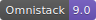
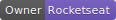

<h1 align="left">
    
</h1>

  

  

  

#  💻 Sobre o projeto
O projeto contido nesse repositório faz parte do conteúdo oferecido pela empresa [__Rocketseat__](https://github.com/Rocketseat) em um evento de uma semana chamado __Semana Omnistack__ que funciona como uma introdução ao curso [__GoStack Bootcamp__](https://rocketseat.com.br/bootcamp). 
  
## O que foi desenvolvido na Semana Omnistack
>O __Aircnc__ é um projeto que visa conectar empresas que querem abrir spots e desenvolvedores que procuram um lugar para trocar ideias com devs, conhecer a empresa e trabalhar lá por um período.

Realizei a implementação do código seguindo as instruções das aulas. Abaixo segue uma animação demostrando a minha aplicação funcionando conforme o esperado: 

  

### Tecnologias

>Esse projeto foi desenvolvido com as seguintes tecnologias:
>- [Node.js](https://nodejs.org/en/)
>- [React](https://reactjs.org) 
>- [React Native](https://facebook.github.io/react-native/)
>- [Expo](https://expo.io/)

Utilizando __Node.js__ no backend, __React__ no frontend web e __React Native__ no mobile, a Semana Omnistack exemplificou o uso de diversas ferramentas. Por exemplo:  
 - [__Expo__](https://expo.io/): facilitando a configuração do ambiente mobile, permitindo o sistema funcionar em dispositivo físico através de uma aplicação disponível nas lojas de aplicativo ( [Android](https://play.google.com/store/apps/details?id=host.exp.exponent&referrer=www) | [iOS](https://apps.apple.com/app/apple-store/id982107779) ).

- [__Insominia__](https://insomnia.rest/): permite a criação de chamadas ao backend através de requisições POST, GET, PUT, DELETE, entre outras. A ferramenta além de viabilizar os testes no backend e facilitar seu desenvolvimento permite a criação de uma documentação bem sólida, muito importante para o desenvolvimento dos *clients* que irão consumir os dados posteriormente.  

- [__Socket.io__](https://socket.io/): permite a comunicação em tempo real entre o backend e os *clients* web e mobile. 

- [__MongoDB Atlas__](https://www.mongodb.com/cloud/atlas): um banco de dados NoSQL hospedado em nuvem. A partir da criação já é possível criar gratuitamente um banco de dados MongoDB capaz de suportar aplicações de diversos tamanhos. O banco é gratuito até certo ponto e depois pode ser verificado um orçamento clicando [aqui](https://www.mongodb.com/cloud/atlas/pricing)

Além desses citados acima muitas outras bibliotecas e recursos foram exemplificadas, uma grande contibuição para o aumento da comunidade de desenvolvedores da stack  Node.js, React e React Native. 

### Créditos 

Para quem quiser saber mais sobre a Semana OmniStack basta acompanhar a Rocketseat em seu canal no [Youtube](http://youtube.com/rocketseat) ou pelo [site](https://rocketseat.com.br/).